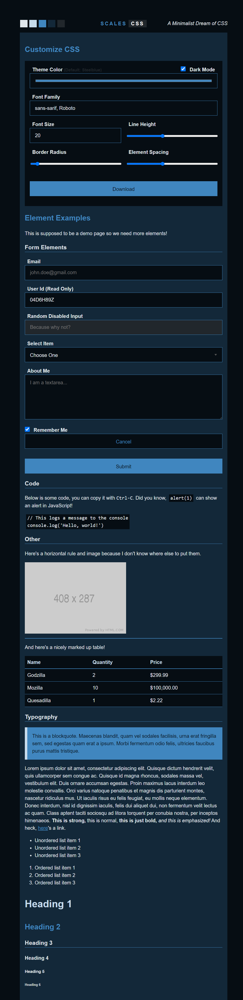
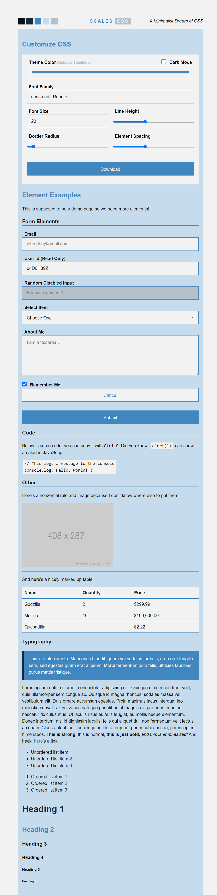

# Grayscale CSS

> CSS For Minimalists

Grayscale is a tiny-dynamic-classless css stylesheet designed for rapid prototyping. Use AS-IS or... 

**CHANGE A SINGLE COLOR** and **REDEFINE YOUR ENTIRE THEME**, complete with *light* and *dark* modes.

It *may* be `classless`, but it *oozes* with an [extendable](src/extras) style that just rocks!! 

All in **2kb gzipped!**

### Features

- Tiny, 2kb
- Classless 
- Dynamic, 15 Custom CSS Vars
- Pure CSS Theme Generation
- Includes Light and Dark Themes

> WARNING: ever-green browsers need only apply ;)

## Check it Out

- [Theme Builder](https://n2geoff.github.io)

While **Grayscale CSS** can generate a dynamic theme based on A SINGLE COLOR, it defaults to a beautiful theme is based on `steelblue` , and of course that comes in both `light` and `dark` variants

---

  
  

---

Add `data-theme="dark"` to the `html` tag for a taste of the dark side

## LICENSE

- [MIT](LICENSE)

## TODO

Still have a bunch of tiny tweaks and extras to build, but th

- clamp themes, saturation and lightness above 80, or below 20 just wont work

- add theme to parts, checkbox, radio button, range sliders ect...

- styles for `details` & `summary`

- ability for an accent color (defaults to theme)

- Tweak `code`, `pre`, `kbd`

- input highlight on focus

- documentation around `main` , `article`, `section` tags
